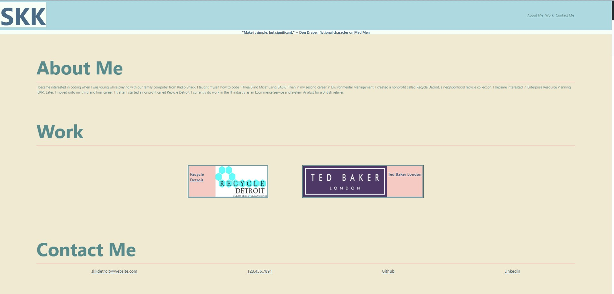

PORTFOLIO

`https://sarahkubik.github.io/SKK-Portfolio/`
 
`https://github.com/SarahKubik/SKK-Portfolio.git`

NOTES
 
As a new developer, I am creating a faux portfolio to illustrate work and skills.

The faux portfolio consists of basic use of coding languages, HTML and CSS.

Header topics link to different sections of the webpage for easy navigation.

Use of responsive layout which allows resizing of page or view dependent on type of screen or device.

